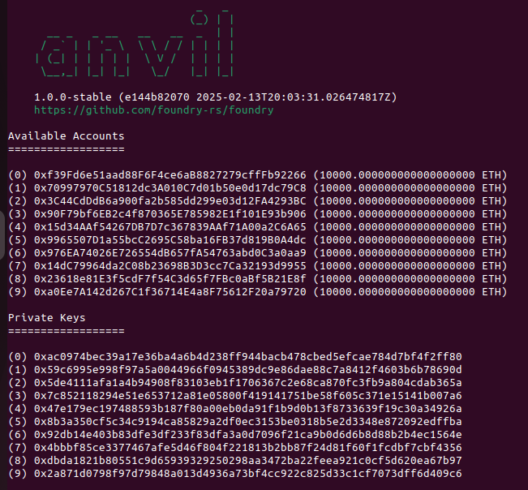

# Smart Contract Deploying Testing

You can use `anvil` command which is included in the foundry toolkit to deploy the smart contract locally.

1. Run `anvil`

You will get 10 pre-funded accounts with 10 private keys for testing.

Now you have like a blockchain simulation listening on 127.0.0.1:8545. It's similar to when you run **http-server** while developing web2 app.

2. Open another terminal tab and run the following command while passing **account one private key** as a value for `--private-key` option:
   
   `forge script script/Deploy.s.sol --broadcast --rpc-url [http://127.0.0.1:8545](http://127.0.0.1:8545) --private-key 0xac0974bec39a17e36ba4a6b4d238ff944bacb478cbed5efcae784d7bf4f2ff80`
   
   Now if there is no errors, you deployed the smart contract locally and you can check some useful info like the gas used, the block id and some other useful info.
